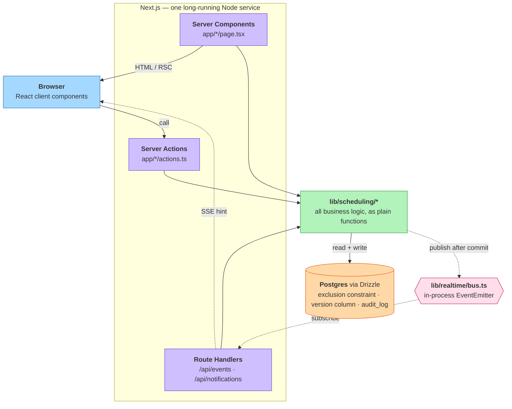

# ShiftSync architecture

One Node service on Railway, one Postgres. Editable source:
[`architecture.excalidraw`](architecture.excalidraw) — open it at
[excalidraw.com](https://excalidraw.com) via *Open*. The diagram below is the
same thing, so it renders here.

## The three flows

**Write** — Browser → Server Action → service → Postgres. Actions are thin
wrappers; they authorize nothing and decide nothing. The **constraint**, not the
application, is what refuses an illegal schedule, so it holds no matter what
writes to the table.

**Read** — Server Component → service → Postgres, rendered on the server. Pages
never query directly.

**Realtime** — a hint, never data. The service publishes *after* the transaction
commits, the stream nudges the browser, and the browser refetches the read path
above. A missed event therefore costs one redundant query rather than a stale
roster — and clients refetch on reconnect for the same reason.

The bus is in-process, which assumes a single instance. Swapping it for Postgres
`LISTEN`/`NOTIFY` changes only that one file — the reasoning is under
"Decisions the brief did not raise" in [decisions.md](decisions.md).
