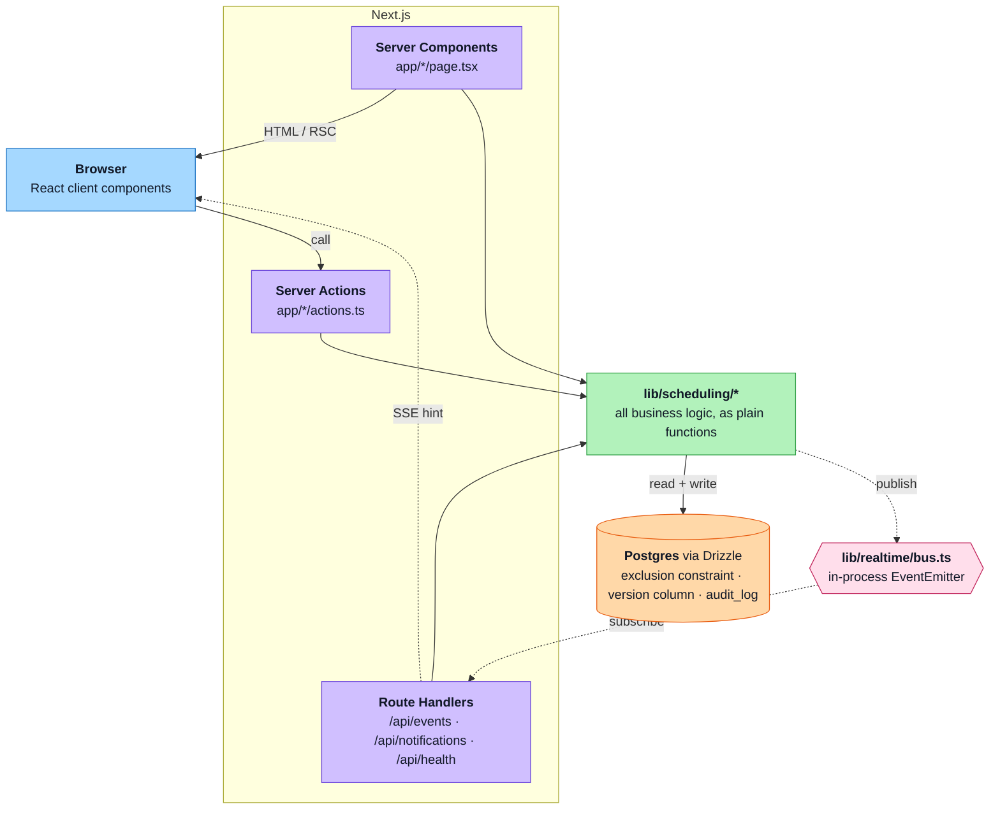

# ShiftSync architecture

One long-running Node service on Railway, one Postgres.

## The three flows

**Write.** Browser, server action, service, Postgres. Actions are thin wrappers:
they catch errors and revalidate, nothing else. Authorization and every rule
live in the service. The exclusion constraint, not the application, is what
refuses an overlapping or short-rest assignment, so it holds whatever writes to
the table.

**Read.** Server component, service, Postgres, rendered on the server. No page
queries the database directly.

**Realtime.** The stream carries a hint, never data. A client refetches on every
event and on every reconnect, so an event missed while disconnected costs one
redundant query instead of a stale roster.

Schedule changes are published **after** the transaction commits, because an
emitter has no rollback. Notification hints are published **inside** it, which
is safe for the same reason the payload is a hint: if the transaction rolls
back, the client refetches and finds nothing new.

## Known shape

The bus is in-process, so fan-out assumes a single instance. Moving to Postgres
`LISTEN`/`NOTIFY` changes only `lib/realtime/bus.ts`. See
[decisions.md](decisions.md).
