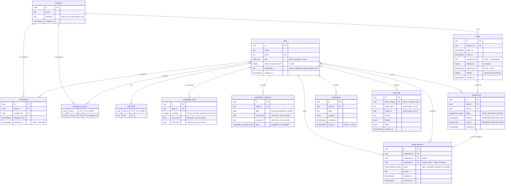

# ShiftSync data model

Generated by hand from [`lib/db/schema.ts`](../lib/db/schema.ts). If you change
the schema, change this too.

## Entity relationships

## Reading the diagram

### `assignments.starts_at` / `ends_at` are denormalized on purpose

They duplicate `shifts.starts_at` / `ends_at`. This is the one deliberate
denormalization in the model and the reason the whole thing works.

A Postgres table constraint can only see columns on the row it is checking. The
`no_overlap_or_short_rest` exclusion constraint needs to compare *time ranges
per staff member*, and `staff_id` only exists on `assignments` — so the times
have to be there too. Putting them there is what lets the database, rather than
application code, be the thing that enforces no double-booking and 10 hours of
rest. See [`drizzle/0001_no_overlap_or_short_rest.sql`](../drizzle/0001_no_overlap_or_short_rest.sql).

The cost is a **sync obligation**: any transaction that moves a shift's times
must update that shift's `active` assignments before it commits. Nothing in the
database enforces this — it is the one invariant carried by convention. It lives
in `lib/scheduling/*`, and [`assign.ts`](../lib/scheduling/assign.ts) is where
the times are copied on the insert path.

### Instants vs. wall-clock time

The two are never mixed, and the distinction is the reason DST stays correct.

| | Stored as | Examples |
| --- | --- | --- |
| **Instant** — a fixed point on the timeline | `timestamptz`, always | `shifts.starts_at`, `assignments.ends_at`, `certifications.effective_from`, every `created_at` |
| **Wall-clock intent** — a local time that means the same thing year-round | local `time` / `date` + the owner's IANA timezone | `availability_rules.start_local`, `availability_exceptions.date` |

No column pair anywhere splits an *instant* into a separate date and time.

`availability_exceptions` does hold a `date` and a `time` side by side, which
looks like the thing we just forbade — it isn't. That pair is not an instant.
"I am unavailable 14:00–18:00 on 2026-03-08" is a statement about the staff
member's local calendar, and it is resolved against `staff.availability_tz` at
query time. Freezing it into a UTC offset at write time is exactly what breaks
when the offset changes: a rule written in January would silently shift by an
hour in July.

### Eligibility

Two separate gates, both of which a scheduler has to satisfy:

- **`certifications`** — may this person work at this *location*? Open-ended
  until revoked, so validity is the half-open interval
  `[effective_from, revoked_at)`.
- **`staff_skills` vs. `shifts.required_skill`** — may this person work this
  *kind of shift*?

`manager_locations` is authorization, not eligibility: it is who may *edit* a
location's schedule, and it is what `/api/events/[locationId]` will check once
Auth.js is wired up.

## Enums

| Type | Values |
| --- | --- |
| `staff_role` | `staff`, `manager`, `admin` |
| `assignment_status` | `active`, `cancelled`, `declined` |
| `availability_exception_kind` | `available`, `unavailable` |
| `swap_request_status` | `open`, `accepted`, `rejected`, `cancelled` |

`assignment_status` carries weight beyond labelling: the exclusion constraint is
partial, `WHERE (status = 'active')`. Cancelled and declined rows stop occupying
the staff member's time and can sit on top of an active assignment without
conflicting.

## Cascade behaviour

Every foreign key is `ON DELETE CASCADE` except two, which are `ON DELETE SET NULL`:

- `swap_requests.requested_to` — deleting the offeree reopens the request to
  anyone rather than destroying it.
- `audit_log.actor_staff_id` — the trail must outlive the actor. This is also
  why `entity_type` / `entity_id` are polymorphic with no foreign key: an audit
  row has to survive deletion of the thing it describes.

Deleting a `location` therefore removes its shifts and, through them, their
assignments. Deleting a `staff` row removes their assignments, availability,
skills and certifications, but leaves the audit trail standing.
